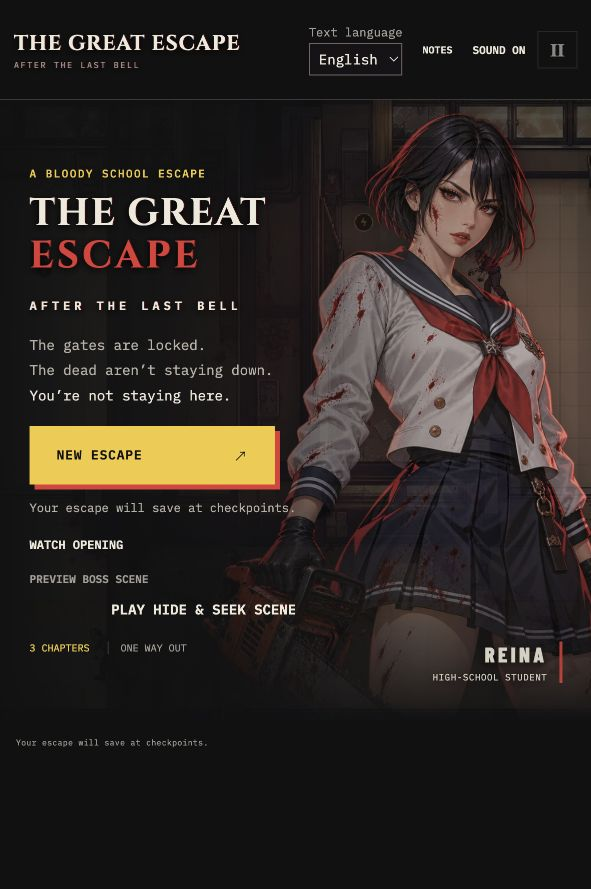

# The Great Escape
### After the Last Bell

A locked school. An unexplained outbreak. One student determined to bring everyone home.

**[Play in your browser](https://kris36dev.github.io/CS691_CapstoneProject/)** · [Original capstone demo](Artifacts/demo%20vedio.mp4) · [Technical paper](Artifacts/Technical%20paper/The%20Great%20Escape%20Technical%20Paper.pdf)

[](https://kris36dev.github.io/CS691_CapstoneProject/)

Guide Reina through a school under quarantine, uncover the records behind the outbreak, and help Yui and the surviving students escape. This playable browser adaptation includes three connected chapters, illustrated story sequences, and a final confrontation with Headmaster Kuroda.

## Play

Open the browser edition and select **New Escape**. Use **Continue** to return to a saved checkpoint. The title screen also offers the opening, boss scene, and classroom hiding sequence as previews.

- **The Lockdown:** restore the classroom circuit with a wire-dragging puzzle.
- **Dead Air:** find medical supplies and a maintenance card, then unlock the courtyard route.
- **Classroom interlude:** hide from Kuroda and steady Reina's breathing by tapping to the ECG rhythm.
- **The Last Bell:** start the generator, survive the Headmaster, and escape through the north gate.

Stylized blood, zombie violence, sudden scares, and flashing impact effects are present. Camera impact, blood effects, and visibility can be adjusted from the pause screen.

## Controls

| Action | Keyboard / mouse |
| --- | --- |
| Move | WASD or arrow keys |
| Run | Shift |
| Chainsaw attack | J or left click |
| Dodge | Space |
| Interact | E |
| Heal | H |
| Notes | Q or Notes button |
| Pause | Escape |
| Story advance | Continue button / Enter when focused |
| Steady breathing | Space or tap the ECG monitor |

Touch controls are available. Connect wires by holding a plug, dragging it to the matching socket, and releasing; keyboard users can select corresponding terminals.

## Languages and sound

Choose **English**, **日本語**, or **简体中文** from the text-language selector. Dialogue, objectives, notes, and interface text change without restarting the game. Your language preference stays in the browser.

Audio consists of atmospheric ambience and game sound effects. This edition does not include spoken dialogue. The Sound button mutes or enables audio.

## Checkpoints

The GitHub Pages edition saves chapter entries and completed objectives in this browser's local storage. Saves remain on this device and browser; clearing site data removes them. Private browsing and blocked storage may prevent saving. The original hosted edition retains its own cloud checkpoint service; saves do not transfer between editions.

## Run locally

No package installation or build is required for the browser game:

```sh
python3 -m http.server 8080 --directory docs
```

Open `http://localhost:8080`. Serve the files over HTTP rather than opening `index.html` directly.

With Node.js 22 or newer, run the gameplay and localization checks:

```sh
npm test
```

The `docs/` directory contains the playable source and artwork. Tests cover movement, combat, puzzles, chapter progression, hiding outcomes, language catalogs, and checkpoint storage. GitHub Pages publishes `main` → `/docs`.

## Original capstone archive

This repository also preserves the original **Pace University · CS691 · Spring 2024** Unity capstone materials. The browser adaptation is a separate playable edition; the archived documents describe the original team project.

| Material | Link |
| --- | --- |
| Project description | [Read](Artifacts/Project%20Description/Project%20Description.pdf) |
| Product personas and user stories | [Personas](Artifacts/Product%20Personas/) · [User stories](Artifacts/User_story/user_strories.docx) |
| System design | [Architecture diagrams](Artifacts/Architecture%20Diagram/) |
| Sprint records | [Sprint 0](Sprint%200.md) · [Sprint 1](Sprint%201.md) · [Sprint 2](Sprint%202.md) · [Sprint 3](Sprint%203.md) |
| Presentations | [Slides](Artifacts/Slides/) |
| Technical paper | [PDF](Artifacts/Technical%20paper/The%20Great%20Escape%20Technical%20Paper.pdf) |
| Recorded demonstration | [Video](Artifacts/demo%20vedio.mp4) |
| Original Unity setup | [Deployment manual](Artifacts/Deployment%20Manual_%20Detailed%20Guide%20to%20Downloading%2C%20Unzipping%2C%20Importing%2C%20and%20Playing%20a%20Game%20in%20Unity-3.pdf) |

The archive does not contain a complete Unity source checkout. The original `Game` note and historical sprint links are retained as submitted.

## Credits

**Original capstone team:** Linlan Cai, Zhifu Chen, Krits Chotechuangchaikul, Sarthak Mishra, Aakash Akhilesh Patel, Hitesh Pulivarthi, and Yash Vora.

[Team agreement](Artifacts/Team%20Working%20Agreement/Teamwork%20Agreement.pdf) · [Original team repository](https://github.com/lialazyoaf/CS691_CapstoneProject)

Browser edition maintained by **Krits Chotechuangchaikul**. Original team credits and project artifacts remain part of this repository. Cinzel font is distributed with its [SIL Open Font License](docs/assets/fonts/OFL.txt). Other existing artwork and project materials retain their original attribution; no blanket license is granted here.
